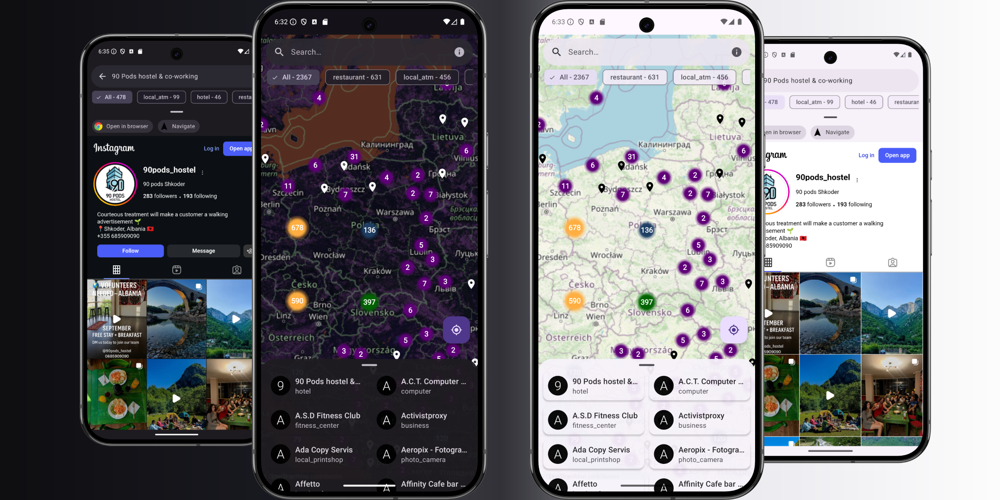

<h1>OpenCoinMap</h1>

## About
**OpenCoinMap** is an Android app that utilizes [OpenStreetMap](https://www.openstreetmap.org/) and [BtcMap](https://github.com/teambtcmap/btcmap-api) APIs to display **cryptocurrency related points of interest** on a map.

## Features
- **Interactive map** powered by **OpenStreetMap**
- **Place discovery** with filtering and search
- **Dynamic** light/dark **theming**
- **Offline caching** for points of interest
- **Background synchronization** using WorkManager

## Used technologies
- [Hilt](https://developer.android.com/training/dependency-injection/hilt-android) - dependency injection
- [Retrofit](https://square.github.io/retrofit/) - networking
- [RxJava](https://github.com/ReactiveX/RxJava) / [RxKotlin](https://github.com/ReactiveX/RxKotlin) - reactive programming
- [Room](https://developer.android.com/jetpack/androidx/releases/room) - local database for on-device storage
- [WorkManager](https://developer.android.com/jetpack/androidx/releases/work) - periodic background data synchronization
- [OSMdroid](https://github.com/osmdroid/osmdroid) - displaying OpenStreetMap tiles and overlays
- [Coil](https://coil-kt.github.io/coil/) - image loading
- [DataStore](https://developer.android.com/topic/libraries/architecture/datastore) - persistent data storage
- [Timber](https://github.com/JakeWharton/timber) - logging
- [Kotlinx Serialization](https://github.com/Kotlin/kotlinx.serialization) - JSON serialization
